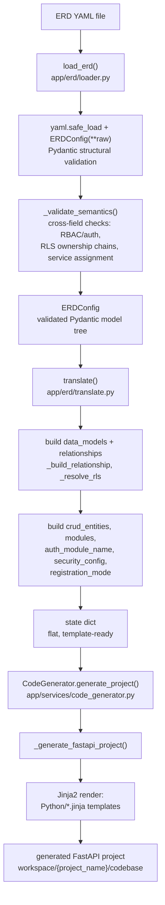

# Pipeline overview

BackStudio turns one ERD YAML file into a runnable FastAPI project in three stages, each its
own module: `app/erd/loader.py` (parse + validate), `app/erd/translate.py` (shape the data for
templates), and `app/services/code_generator.py` (render templates to files). Each stage has a
single entry point and a distinct input/output shape — this page walks through them in order,
citing the real current function/class names.

## Stage 1: `app/erd/loader.py` — YAML to a validated `ERDConfig`

The entry point is `load_erd(path)`. It:

1. Reads the file and runs `yaml.safe_load()`, raising `ERDValidationError` on a missing file,
   invalid YAML, an empty file, or a non-mapping top level.
2. Constructs `ERDConfig(**raw)` (the root Pydantic model defined in `app/erd/schema.py`). This
   is where structural validation happens — wrong types, missing required fields, unknown
   literals — via Pydantic itself, surfaced as `ERDValidationError` wrapping the underlying
   `pydantic.ValidationError`.
3. Calls the private `_validate_semantics(erd)`, which is where BackStudio's own cross-field,
   whole-document rules live — the checks a single field's type alone can't express. These
   include (not exhaustive):
   - At least one entity declared.
   - `rbac.enabled` requires `auth.enabled: true`, and requires `"admin"` be one of
     `rbac.roles` (the auto-generated admin user-management endpoints are hard-gated to that
     role name).
   - `auth.registration.mode: admin_approval` requires `rbac.enabled: true` (the approve
     endpoint is admin-gated).
   - No duplicate entity names; a declared `User` entity is rejected unless `auth.enabled` is
     true (otherwise it would be silently dropped).
   - No duplicate field names per entity; on `User`, declared field names may not collide with
     the auto-injected auth fields (`id`, `email`, `password_hash`, `roles`, `is_active`,
     `created_at`, `updated_at`, plus `is_verified`/`is_approved` when the registration mode
     gates them in).
   - Relationship targets must resolve to a known entity (or `User`, if auth is enabled); a
     self-referential many-to-many is rejected outright (not supported by the generator's
     naming conventions).
   - `endpoints.rbac` and `rbac.default_permissions` overrides may only reference declared
     `rbac.roles`.
   - RLS structural rules, in `_validate_rls()`: every `owner: true` relationship's entity must
     declare an `rls:` block; `identity_source.type: auth_user` requires `auth.enabled: true`
     and an owner relationship targeting `User`; `rls.bypass_roles` requires
     `rbac.enabled: true` and is rejected outright when `identity_source.type` is `header`
     (a header-sourced identity carries no role information to bypass with); every
     `cascades_ownership: true` chain must terminate at an `owner: true` entity without cycling.
   - Service-assignment rules, in `_validate_services()`: every non-`User` entity must be
     assigned to exactly one `services:` entry; the `User` entity, if referenced at all, must be
     the sole entity of its own service entry; service names must be unique and the auth
     service's resolved module name (see [`translate()`](#stage-2-apperdtranslatepy-erdconfig-to-the-flat-state-dict) below) can't collide with another service's name.

`load_erd()` returns a validated `ERDConfig` — the Pydantic model tree defined in
`app/erd/schema.py` (`ERDConfig.project`, `.database`, `.auth`, `.rbac`, `.entities`,
`.services`). Nothing downstream re-checks these invariants; `translate()` assumes they already
hold.

## Stage 2: `app/erd/translate.py` — `ERDConfig` to the flat `state` dict

The entry point is `translate(erd: ERDConfig) -> Dict[str, Any]`. Its job is to turn the
declarative, relationship-graph-shaped `ERDConfig` into a flat dict of plain
dicts/lists/strings — the exact shape `CodeGenerator` (and, transitively, every Jinja2
template) consumes. Nothing downstream touches an `ERDConfig`/Pydantic object again.

Concretely, `translate()`:

- Builds `data_models`: one dict per entity (keyed by name), each with `name`, `table_name`
  (`_table_name()` — the entity's explicit `table_name` or a pluralized snake-case default via
  `_pluralize()`/`_snake_case()`), `plural_snake`, `fields` (each `ModelField` dumped to a plain
  dict via `model_dump(mode='json')`), and `relationships`.
- If `erd.auth.enabled`, injects a synthetic `User` model via `_build_user_entity()`: the seven
  fixed `AUTH_USER_FIELDS` (`id`, `email`, `password_hash`, `roles`, `is_active`, `created_at`,
  `updated_at`), plus `is_verified` when `auth.registration.mode == "email_verification"` or
  `is_approved` when `"admin_approval"` — this is the "mode-aware `User` fields" behavior — plus
  any fields the ERD author declared directly on a `User` entity, merged in afterward.
- Builds every relationship dict via `_build_relationship()` — deriving attribute names, FK
  column names, and (for many-to-many) association-table shape, using `rel.name` as the naming
  basis instead of the generic target-derived default whenever an entity declares more than one
  relationship to the same target, or the relationship is self-referential (`use_name_basis`).
  `_validate_relationship_uniqueness()` then raises `ERDValidationError` if two relationships on
  the same entity would still derive a colliding attribute or FK column name.
- Derives `owned_relationships` (`_owned_relationships_for()`) and
  `many_to_many_relationships` (`_many_to_many_relationships_for()`) per model, then resolves
  row-level-security ownership for every model via `_resolve_rls()` — walking `owner: true` and
  `cascades_ownership: true` relationships to attach an `rls` dict (root model, owner FK column,
  join chain, identity source, bypass roles) to each model, or `None` if the entity isn't
  RLS-governed.
- Builds `crud_entities`: one dict per non-`User` entity carrying everything the CRUD
  service/route/schema templates need — `base_path`, `tags`, `enabled_actions`, resolved
  per-action `rbac` (via `_resolve_rbac()`, which layers `endpoints.rbac` overrides over
  `rbac.default_permissions` over "all declared roles if RBAC is enabled" over "no roles"), and
  the model's `owned_relationships`/`many_to_many_relationships`/`rls`.
- Builds `modules`: one dict per `services:` entry *other than* the auth (`User`-only) service,
  via `_resolve_modules()` — `{name, snake_name, entities: [...crud_entities for that
  service...]}`.
- Resolves `auth_module_name` via `_resolve_auth_module_name()` — the snake-cased name of the
  `services:` entry whose `entities == ["User"]`, defaulting to `"auth"` if none is declared.
- Builds `security_config` (JWT strategy, secret env var, algorithm, and the four expiration
  settings) when `auth.enabled`, else `None`.

The returned `state` dict's top-level keys (verified against the real `return` statement) are:
`name`, `description`, `version`, `framework`, `checksum`, `data_models`, `relationships`,
`middlewares`, `dependencies`, `database_config`, `security_config`, `modules`,
`auth_module_name`, `auth_enabled`, `rbac_enabled`, `rbac_roles`, `registration_mode`. This dict
is what `CodeGenerator.generate_project()` receives — it never sees an `ERDConfig`.

## Stage 3: `app/services/code_generator.py` — `state` to rendered files

`CodeGenerator.generate_project(project_state, force=False)` is the entry point. It resolves
the output directory (`workspace/{project_name}/codebase`), refuses to overwrite an existing
one unless `force=True`, and — for `framework == 'fastapi'` (the only supported value) —
delegates to `_generate_fastapi_project(state, output_dir)`, which drives every Jinja2 render
call.

`_generate_fastapi_project()` builds one base context, `context = {'project': state}`, and
reuses it for every file that isn't module-specific: `database/base.py.jinja`,
`database/models.py.jinja`, `database/repo.py.jinja`, the four `auth/*.jinja` templates (only
when `state['auth_enabled']`), `rbac/dependency.py.jinja` (only when `state['rbac_enabled']`),
the Alembic scaffolding (`alembic.ini.jinja`, `env.py.jinja` — unconditional, every generated
project gets migrations; `script.py.mako.jinja` is copied verbatim rather than rendered, since
its `${...}` syntax belongs to Alembic's own Mako templating, not Jinja2), and the
top-level `config.py.jinja`, `server.py.jinja`, `middleware.py.jinja`, `dependencies.py.jinja`,
`requirements.txt.jinja`, `README.md.jinja`, and `gitignore.jinja`.

For each entry in `state['modules']`, it instead builds a **second, per-module** context,
`module_context = {'project': state, 'module': module}`, and renders
`service/module_schemas.py.jinja`, `service/module_service.py.jinja`, and
`service/module_routes.py.jinja` once per module into `modules/{module['snake_name']}/`. This
`{'project': state, 'module': module}` shape is exactly the templates that need to iterate a
single module's entities in isolation — see
[Template system: the two context shapes](templates.md#the-two-context-shapes) for the full
list and why mixing the two up has historically caused real bugs.

The result of `generate_project()` is the path to the generated codebase directory — a
self-contained FastAPI project ready to run, with its own `database/`, `modules/`, `alembic/`,
`server.py`, `config.py`, and `requirements.txt`.
